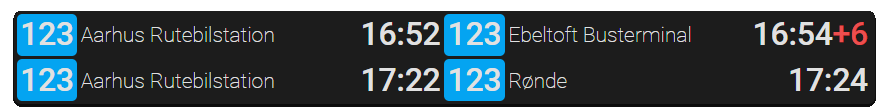

# compact-timetable-card
A Home Assistant custom card component, that shows the upcoming public transport departures at a given stop, in a compact timetable. As of now, only the Rejseplanen integration in Home Assistant is supported.



| Config Option | Type    | Required | Description
|---------------|---------|----------|-
| ```type```    | String  | True     | ```custom:compact-timetable-card```
| ```entity```  | String  | True     | Rejseplanen next departure sensor entity
| ```rows```    | Integer | True     | Number of rows to display (1 - 10). Two departures are shown per row.

```yaml
type: custom:compact-timetable-card
entity: sensor.next_departure
rows: 2
```
